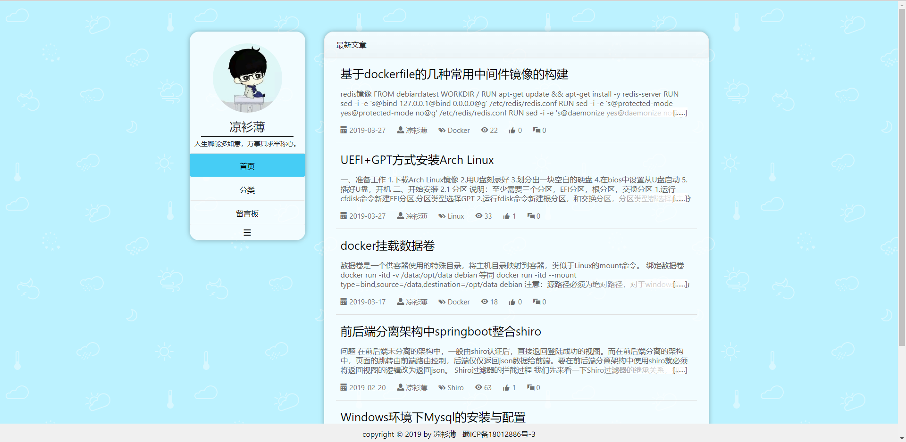
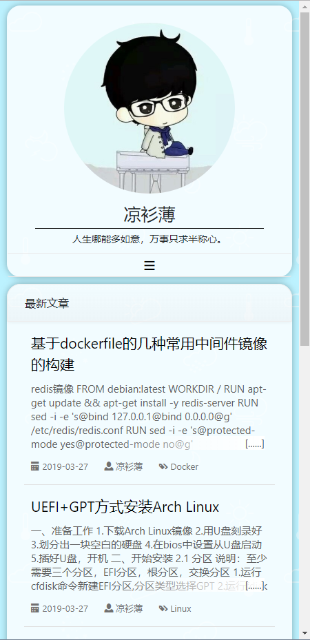

# 虫洞博客
[](https://github.com/stdutil/blog-springboot/releases)
[](https://github.com/stdutil/blog-springboot/network/members)
[](https://github.com/stdutil/blog-springboot/stargazers) 
[](https://github.com/stdutil/blog-springboot/archive/master.zip)
[](https://github.com/stdutil/blog-springboot/releases)
[](https://github.com/stdutil/blog-springboot/blob/dev/LICENSE)

## 响应式布局
|pc布局|mobile布局|
|:---:|:---:|
|||

## 介绍
本博客系统是在原来的[SSM架构的博客系统项目](https://github.com/stdutil/blog-ssm)基础上，用`springboot`重写的，简化了很多繁琐的xml配置。项目同样
整合了许多常用的框架和中间件，例如Redis,Druid,Redis,Freemarker,Shiro等配置，此项目不管是作为当下互联网项目架构的脚手架，还是学习为目的，都是一个不错的选择。

## 技术架构
* SpringBoot - [SpringBoot](https://spring.io/projects/spring-boot/)
* Druid - [Druid](http://druid.io/)
* 持久化框架 - [Mybatis](http://www.mybatis.org/mybatis-3/)
* 缓存 - [Redis](https://redis.io/)
* 认证授权安全框架 - [Shiro](http://shiro.apache.org/)
* 模板渲染引擎 - [Freemarker](https://freemarker.apache.org/)
* 模块化前端框架 - [Layui](https://www.layui.com/)
* markdown编辑器 - [editor.md](http://pandao.github.io/editor.md/examples/)
* 日志系统 - [slf4j](https://www.slf4j.org/) + [logback](https://logback.qos.ch/)

## 使用说明
* 只需要将`application.properties`中的`spring.datasource.username`和`spring.datasource.password`改为你的数据库账户和密码,数据库
和redis都是按照默认的端口配置，如有需要也可更改配置文件，然后将打包后war包扔进webapp目录即可,容器初始化时会自动建表,无需手动建表。
* 注意用外置的servlet容器部署时，需要配置去除项目名访问，不然会404。
* 后台管理系统地址为`http://domain:port/admin`，初始用户名为`363408268@qq.com`,初始密码为`19960821`。

## 环境搭建
>使用内嵌servlet容器部署，直接运行`java -jar blog.war`即可，下面主要介绍通过外置servlet容器部署。
### Linux 环境部署
1.下载并解压 [JDK 1.8](https://www.oracle.com/technetwork/java/javase/downloads/jdk8-downloads-2133151.html)
>注意不要用linux自带的openjdk
```
tar zxvf jdk-8u172-linux-x64.tar.gz
mv jdk1.8.0_172 /usr/local/jdk
```
2.下载并解压 [Redis 4.0.9](http://www.redis.cn/download.html)
```
tar zxvf redis-4.0.9.tar.gz
mv redis-4.0.9 /usr/local/redis
```
3.下载并解压 [Tomcat 9.0.8](https://tomcat.apache.org/download-90.cgi)
```
tar zxvf apache-tomcat-9.0.8.tar.gz
mv apache-tomcat-9.0.8 /usr/local/tomcat
```
4.安装`MySQL`或`MariaDB`
>注意!如果是`mariadb`需要将`user`表中的`plugin`字段值'unix_socket'改为'mysql_native_password',否则`jdbc`连接会出错
* `Debian`系列`Linux`参考以下过程
```
#apt-get update //获取最新软件包
#apt-get install mariadb mariadb-server //安装mariadb客户端和服务器
#service mysql start //启动服务
#mysql_security_installation //执行安全安装脚本
```
* `Redhat`系列`Linux`参考以下过程
```
#yum update
#yum install mariadb mariadb-server
#systemctl start mariadb
#mysql_security_installation
```
5.设置环境变量(用vim打开/etc/profile这个文件,在后面添加以下内容)
```
export JAVA_HOME=/usr/local/jdk
export JRE_HOME=$JAVA_HOME/jre
export CLASSPATH=.:$JAVA_HOME/lib/dt.jar:$JAVA_HOME/lib/tools.jar:$JAVA_HOME/lib:$JRE_HOME/lib:$CLASSPATH
export PATH=$JAVA_HOME/bin:$JRE_HOME/bin:$PATH

export CATALINA_HOME=/usr/local/tomcat
export CATALINA_BASE=/usr/local/tomcat
export PATH=$CATALINA_HOME/bin:$PATH

export PATH=/usr/local/redis/bin:$PATH
```
6.启动`redis`和`tomcat`
```
redis-server &
startup.sh
```
7.将打包好的`war`包放入`tomcat`的`webapps`目录
### Docker部署(推荐)
1.下载源码后在根目录下运行以下命令
```
mvn package
mvn dockerfile:build
```
2.不出意外本地已经成功生成docker镜像了，你可以push到你的docker仓库中，随时pull到任何一台docker容器中部署了
3.运行容器
```
docker run -d -p 80:80 blog:latest
```
